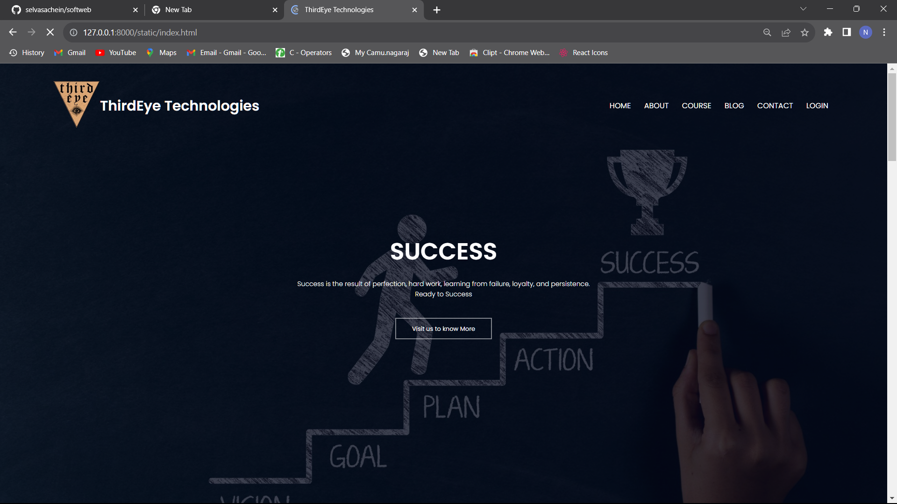
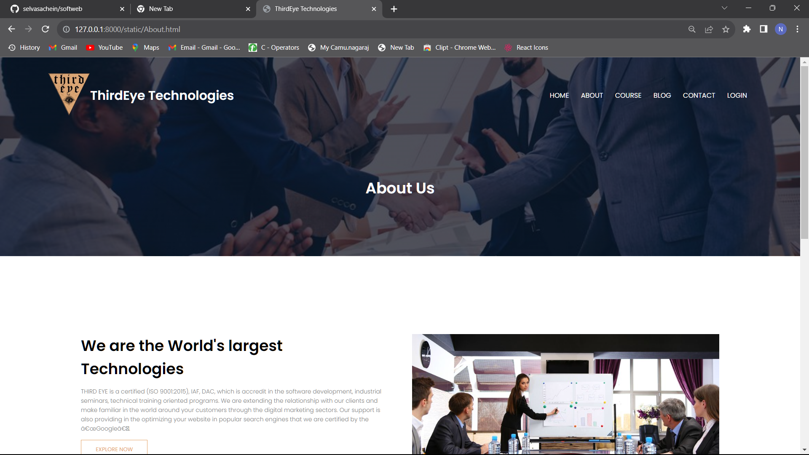
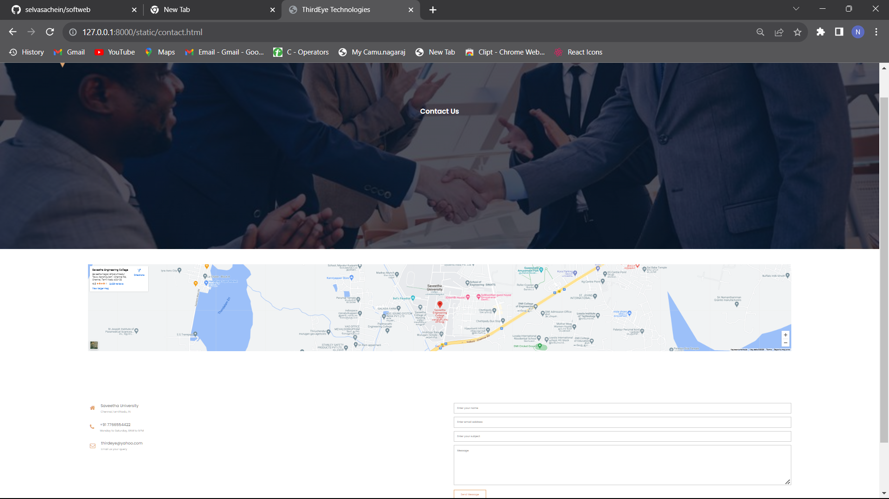
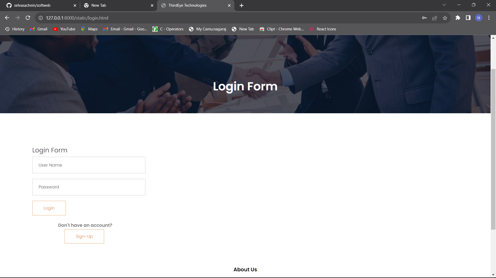
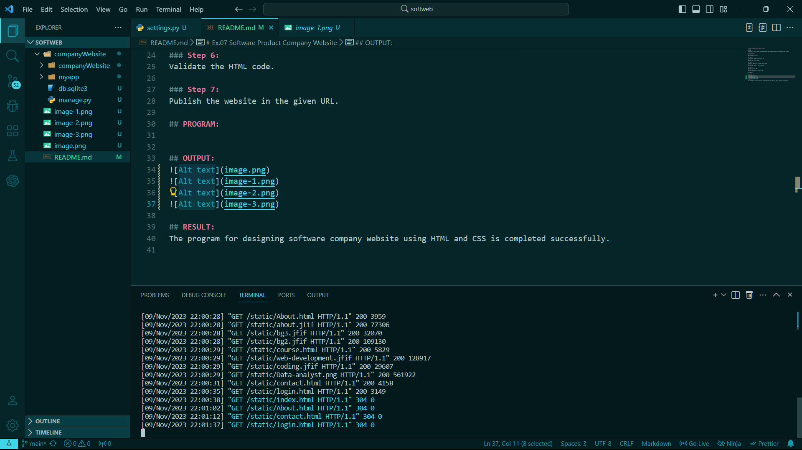

# Ex.07 Software Product Company Website
## Date:

## AIM:
To develop a static company website to display the softwares and services provided by the company.

## DESIGN STEPS:

### Step 1:
Requirement collection.

### Step 2:
Creating the layout using HTML and CSS.

### Step 3:
Updating the sample content.

### Step 4:
Choose the appropriate style and color scheme.

### Step 5:
Validate the layout in various browsers.

### Step 6:
Validate the HTML code.

### Step 7:
Publish the website in the given URL.

## PROGRAM:
```html
<!DOCTYPE html>
<html>
  <head>
    <meta name="view" content="with=device-width, initial-scale=1.0">
    <title>ThirdEye Technologies</title>
    <link rel="stylesheet" href="style.css">
    <link rel="preconnect" href="https://fonts.googleapis.com">
<link rel="preconnect" href="https://fonts.gstatic.com" crossorigin>
<link href="https://fonts.googleapis.com/css2?family=Poppins:wght@100;300;400;600;700&display=swap" rel="stylesheet">

<link rel="stylesheet" href="https://cdn.jsdelivr.net/npm/@fortawesome/fontawesome-free@6.2.1/css/fontawesome.min.css">
<link rel="stylesheet" href="https://cdnjs.cloudflare.com/ajax/libs/font-awesome/4.7.0/css/font-awesome.min.css">
</head>
  <body>
    <section class="header">
      <nav>
        <a href="index.html"> </a>
        <h3 class="com-name">ThirdEye Technologies</h3>
       
        <div class="nav-links" id="navLinks">
          <i class="fa fa-times" onclick="hideMenu()"></i>
          <ul>
            <li><a href="index.html">HOME</a></li>
            <li><a href="About.html">ABOUT</a></li>
            <li><a href="course.html">COURSE</a></li>
            <li><a href="blog.html">BLOG</a></li>
            <li><a href="contact.html">CONTACT</a></li>
            <li><a href="login.html">LOGIN</a></li>
          </ul>
        </div>
        
        <i class="fa fa-bars" aria-hidden="true" onclick="showMenu()"></i>
      </nav>
      
    <div class="text-box">
      <h1>SUCCESS</h1>
      <p>Success is the result of perfection, hard work, learning from failure, loyalty, and persistence.<br> Ready to Success
      </p>
      <a href="About.html" class="hero-btn">Visit us to know More</a>
    </div>
    </section>
<!--COURSE-->
<section class="course">
  <h1>Course We Offer</h1>
  <p>Lorem ipsum dolor sit amet,conswctetur adipiscing elit.</p>

  <div class="row">
    <div class="course-col">
      <h3>Internship</h3>
      <p>we are offering internship for college students,who are studying the department of computers.Topics are Web Development,UX/UI animation design,Data Analyst,Cyber Security and other technical course</p>

    </div>
    <div class="course-col">
      <h3>Inplant Training</h3>
      <p>we are offering inplant Training for college students,who are the final year of Engineering Students.Topics are Web Development,UX/UI animation design,Data Analyst,Cyber Security and other technical course</p>
      
    </div>
    <div class="course-col">
      <h3>Technical Course</h3>
      <p>we are offering technical course for students and also for teaching faculties.We are taking all Technical Courses </p>
      
    </div>
  </div>
</section>
<!--CAMPUS-->

<section class="campus">
<h1>Our Global Campus</h1>
<p>Lorem ipsum dolor sit amet,conswctetur adipiscing elit.</p>
<div class="row">
  <div class="campus-col">
    
    <div class="layer">
      <h3>INDIA</h3>
    </div>
  </div>
  <div class="campus-col">
    
    <div class="layer">
      <h3>AMERICA</h3>
    </div>
  </div>
  <div class="campus-col">
    
    <div class="layer">
      <h3>LONDON</h3>
    </div>
  </div>
</div>
</section>

<!--Facilities-->

<section class="facilities">
<h1>Our Facilities</h1>
<p>Lorem ipsum dolor sit amet,conswctetur adipiscing elit.</p>


<div class="row">
  <div class="facilities-col">
    
    <h3>World Class Library</h3>
    <p>A library is a collection of sources of information and similar resources, made accessible to a defined community for reference or borrowing.</p>
  </div>
  <div class="facilities-col">
    
    <h3>Auditorium</h3>
    <p> A large room to accommodate an audience in a building </p>
  </div>
  <div class="facilities-col">
    
    <h3>Tasty and Healthy Food</h3>
    <p>It is health that is real wealth and not pieces of gold and silver.” – Mahatma Gandhi, lawyer and anti-colonial nationalist.</p>
  </div>
</div>
</section>


<!-------------Testimonials---------->


<section class="testimonials">
<h1>What Our Students Says</h1>
<div class="row">
  <div class="testimonial-col">
    
    <div>
      <p>Around 100% of students get placed in our course.
        The highest salary package offered is 17.5 LPA, 
        the lowest salary package is 4 LPA, 
        and the average salary package is 4.5 LPA. 
        The top recruiting company is Virtusa. 
        Around 95% of students get internships in our course.</p>
      <h3>Frankly</h3>
      <i class="fa fa-star"></i>
      <i class="fa fa-star"></i>
      <i class="fa fa-star"></i>
      <i class="fa fa-star"></i>
      <i class="fa fa-star-o"></i>
    </div>
  </div>
  <div class="testimonial-col">
    
    <div>
      <p> Facilities and infrastructure available for our course are high-speed Wi-Fi. There are different labs like ML lab, VR lab, and robotics lab. Classrooms are the best. Library is great with all kinds of books.</p>
      <h3>Harina</h3>
      <i class="fa fa-star"></i>
      <i class="fa fa-star"></i>
      <i class="fa fa-star"></i>
      <i class="fa fa-star"></i>
      <i class="fa fa-star-half-o"></i>
    </div>
  </div>
</div>
</section>

<!--------Call to action------->

<section class="cta">
  <h1>Enroll for our various online courses <br>Anywhere from the World</h1>
  <a href="contact.html" class="hero-btn">CONTACT US</a>
</section>

<!--------Footer------->

<section class="footer">
  <h4>About Us</h4>
  <p>THIRD EYE is a certified (ISO 9001:2015), IAF, DAC, which is accredit in the software development, industrial seminars, technical training oriented programs. We are extending the relationship with our clients and make familiar in the world around your customers through the digital marketing sectors. Our support is also providing in the optimizing your website in popular search engines that we are certified by the “Google”.</p>
  <div class="icons">
    <i class="fa fa-facebook-square"></i>
    <i class="fa fa-twitter"></i>
    <i class="fa fa-instagram"></i>
    <i class="fa fa-linkedin"></i>
  </div>
  <p>Made By <i class="fa fa-heart-o"></i> NAGARAJ S</p>
</section>

<!--JAVASCRIPT for menu-->
    <script>
      var navLinks=document.getElementById("navLinks");
      function showMenu(){
        navLinks.style.right="0"
      }
      function hideMenu(){
        navLinks.style.right="-200px"
      }
    </script>
  </body>
</html>

```

## OUTPUT:





## RESULT:
The program for designing software company website using HTML and CSS is completed successfully.
